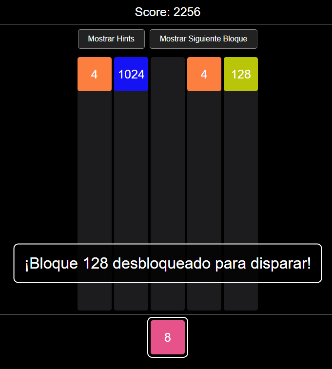

# Informe de la Resolución del Proyecto
*M2 Blocks - Lógica para Cs. de la Computación - 2025*

**Comisión `19`**:
- `Gulino, Franco`
- `Trevisan, Santino`
---

**Estrategia de Implementación en Prolog**

El módulo proylcc implementado en Prolog proporciona la lógica central del juego, gestionando las
principales funcionalidades requeridas. A continuación, se explica la estrategia utilizada para cada
requerimiento funcional.

**Requerimientos**

****

**Generación aleatoria del bloque a disparar** 

Se implementó el predicado randomBlock/2, que utiliza max_in_grid/2 para determinar el máximo
valor numérico en la grilla (ignorando los "-").

El predicado rango_disparo/2 define los rangos permitidos según las reglas especificadas, utilizando
una estructura condicional para mapear el máximo de la grilla a un rango específico.

Se emplea random_member/2 de la librería random para seleccionar un bloque aleatorio del rango.

Para garantizar que los bloques generados sean válidos, generate_valid_next_block/2 intenta hasta
10 veces generar un bloque dentro del rango, recurriendo al primer bloque del rango si falla.

****

**Efecto del disparo de un bloque**

El predicado shoot/5 es la función principal, que: 

* Inserta el bloque en la posición adecuada de la columna.
* Procesa combinaciones(*) iniciales desde la posición de inserción identificando grupos de bloques iguales.
* Calcula el nuevo valor del bloque combinado y el puntaje.
* Aplica gravedad invertida para reubicar los bloques.
* Repite el ciclo de combinaciones y gravedad hasta que no haya más cambios.

(*) Se implementa principalmente en los predicados process_combinations_from_position/5, find_connected_group/5, y determine_destination_position/4 de la siguiente manera:
+ Identificación del grupo conectado:
Cuando se inserta un bloque en la grilla (tras un disparo), se verifica si forma un grupo con bloques adyacentes del mismo valor(horizontal o verticalmente).
+ Validación del grupo:
Un grupo es valido si contiene al menos dos bloques(se incluye el insertado).
+ Determinación de la posición destino:
Caso 2 bloques: Si son vecinos horizontales, el nuevo bloque se coloca en la posición del bloque disparado.
Si son vecinos verticales, se coloca en la posición superior (menor índice).
Caso 3 bloques: La posición resultante es la más cercana al centro del grupo
+ Actualizacion de la grilla: El bloque resultante se coloca en la posicion destino y los demas bloques del grupo se reemplazan por  "-",
+ Se aplica gravedad invertida para ocupar los espacios vacios ("-"). 

Cada efecto se encapsula como effect(Grid, Notificaciones) para que React lo visualice en secuencia. 

****

**Notificaciones**

Las notificaciones (combo, score, newMaxBlock, newBlockAdded, blockEliminated,
cleanup) se muestran como alertas o banners, usando componentes de React.
* combo: Se genera al combinar 3 o mas bloques a partir de un disparo.
* score: Indica el puntaje obtenido de una combinacion.
* newMaxBlock: Notifica la generacion de un nuevo bloque maximo en la grilla. Por ejemplo 512, 1024, etc.
* newBlockAdded: Indica que nuevos valores de bloques se han añadido al rango de disparo debido a un nuevo máximo en la grilla.
* blockEliminated: Indica que bloque se ha eliminado luego de llegar a un maximo en la grilla.
* cleanup: Indica los bloques que han sido eliminado del rango de disparo tambien han sido eliminados de la grilal.

****

**Avisos “Combo x N”**

En process_combinations_from_position/5 , se calcula el tamaño del grupo combinado (GroupSize).

Si GroupSize es 3 o mas , se incluye combo(TotalBlocks) en las notificaciones de cada efecto, junto con el puntaje y el nuevo valor del bloque.

****

**Avisos de nuevo bloque máximo logrado**

En process_cleanup_and_notifications/6, se compara el máximo anterior (MaxAnterior) con el nuevo máximo (MaxNuevo).
Si el nuevo maximo es mayor al maximo anterior, se calculan los bloques retirados (bloques_retirados/3) y agregados (bloques_agregados/3) comparando los rangos de disparo.

Se generan notificaciones:
* newMaxBlock(MaxNuevo) para máximos ≥ 512.
* newBlockAdded(BloquesAgregados) si hay bloques nuevos en el rango.
* blockEliminated si hay bloques retirados.

****

**Limpieza de bloques retirados**

Cada vez que el rango de disparo cambia y se retira un valor, se eliminan todas sus apariciones en la grilla. Esto se logra mediante cleanup_retired_blocks, que reemplaza cada instancia con '-'.

Si hay bloques retirados (BloquesRetirados \= []), se invoca cleanup_retired_blocks/3 para reemplazar los bloques retirados por "-" en la grilla.

Se aplica gravedad tras la limpieza (apply_complete_gravity_cycle/4) para reubicar bloques y procesar nuevas combinaciones.

Se incluye cleanup(BloquesRetirados)en las notificaciones para informar la limpieza.

****

**Booster Hint jugada**

El predicado hint_shot/5 analiza el resultado de disparar un bloque en una columna:
* Verifica si la columna permite un disparo.
* Inserta el bloque y analiza la combinación inmediata con analyze_immediate_combination/4, que identifica vecinos y calcula el puntaje y nuevo bloque.
* Simula el disparo completo para obtener la grilla final y generar un bloque válido para el próximo disparo.

****

**Booster Bloque siguiente**

En init_game_state/3 y update_game_state/3, se generan dos bloques (CurrentBlock y NextBlock) para la cola de disparo.

generate_block_pair/3 se asegura que ambos bloques sean válidos según el rango de la grilla.

En update_game_state/3, tras un disparo, se avanza la cola (NextBlock pasa a ser CurrentBlock) y se genera un nuevo NextBlock.

La interfaz en React controla la visibilidad del NextBlock, mientras Prolog garantiza que los bloques sean válidos.

****

**Funcionalidades extra**
1) Validación exhaustiva de la cola: Se implementó clean_invalid_blocks_from_queue/6 para
garantizar que los bloques en la cola sean siempre válidos, incluso tras limpiezas masivas.
2) Procesamiento exhaustivo de combinaciones: check_and_process_all_combinations/4 asegura
que todas las combinaciones posibles en la grilla se procesen tras un disparo, maximizando el
puntaje.

****

**Desafios enfrentados**
1) Control de la cola del disparo, en el caso donde se eliminaba un bloque de la grilla y a su vez estaba ese mismo bloque en la cola para ser disparado.
2) Gravedad invertida.
3) Logica de las combinaciones para que sea identica con el juego original.

****

**Aspectos positivos** 
1) Modularidad en la lógica.
2) Fluidez en la gravedad.
3) Fluidez con los efectos.
****
**Implementacion en React**

La interfaz en React cumple con los siguientes objetivos: 
* Mostrar el estado actual de la grilla en tiempo real. Visualizar progresivamente los efectos generados tras un disparo (animaciones por pasos).
* Presentar avisos de combos, nuevos bloques logrados y cambios en el rango de disparo. 
* Implementar boosters visuales: Hint (pista) y vista anticipada del siguiente bloque. 
****
**Casos de test**

**Caso 1: "Combo"**

Lo que se lograra observar ahora es la realizacion de un combo, mostraremos 4 imagenes:

+ Imagen 1:

 Muestra la grilla antes de realizar el disparo.

 ****

 + Imagen 2:

 Podemos observar que se realiza el disparo del bloque "2".

 + Imagen 3:

 Logramos ver que los 3 bloques se juntaron para formar uno solo que es el bloque "4". Tambien se observa notificacion de "Combo X3!".

 ****

 + Imagen 4:

 Nueva combinacion entre los bloques "4" y se forma el bloque "8".

 ****

 **Caso 2: "Uso de Hint"**

 Se mostrara el uso del booster "Hint".

 

 Nos muestra que si nos paramos en la ultima columna, el bloque actual a disparar es el "2" y si lo queremos disparar ahi nos dira el combo que se podria dar y el score que obtendremos.

 ****

**Caso 3: "Uso del bloque siguiente"**

Se mostrara el uso del booster "Bloque Siguiente"

Se observa el bloque actual a disparar que es el "2" y se ve el siguiente "16" que le da una ventaja al usuario para simular una mejor jugada.

****

**Caso 4:"Nuevo maximo desbloqueado y bloques retirados"**

En las siguientes 5 imagenes observaremos la secuencia.

Grilla donde se ve el nuevo maximo: "1024".

Notificacion nuevo maximo desbloqueado y eliminacion bloques "2".

Gravedad aplicada al bloque 16 debido a la eliminacion de los bloques "2".

Notificacion nuevo bloque disponible a disparar.

Notificacion de bloques limpiados.
